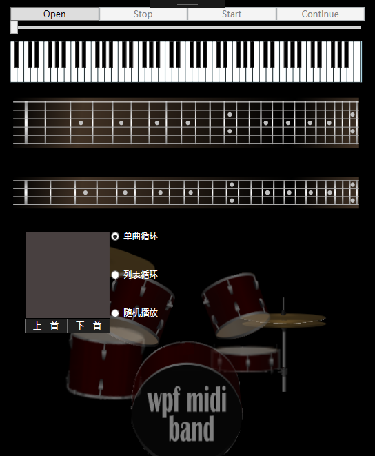
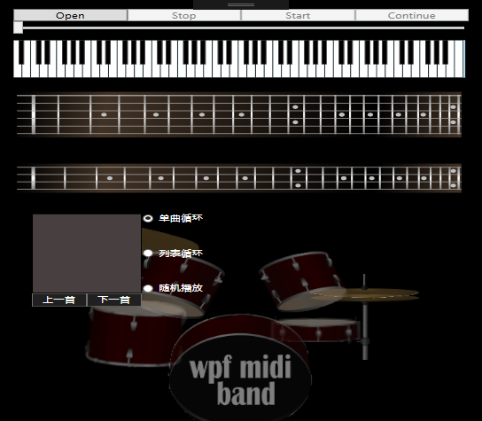
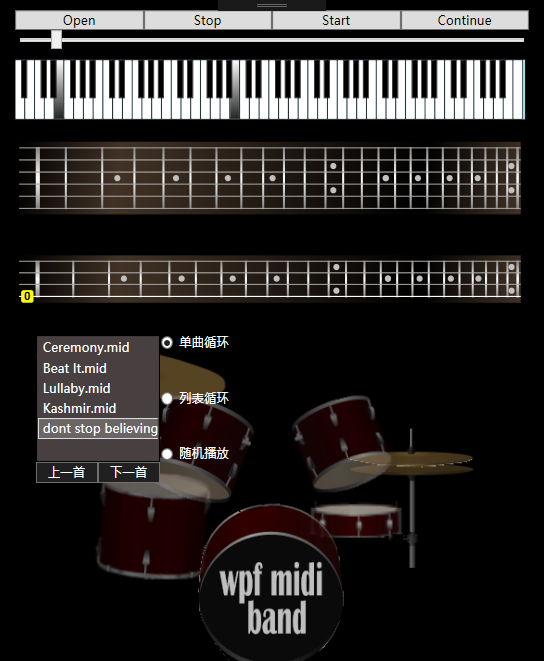
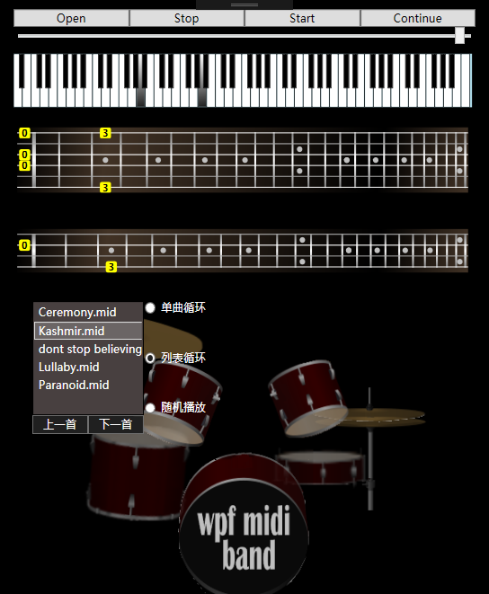
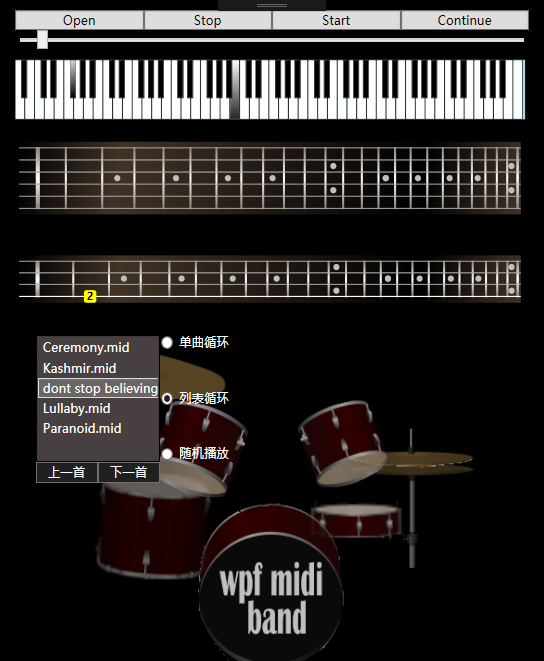

## 功能概述  
1. 程序能正常播放Midi；  
2. 界面的控件能随主界面的改变调整大小和位置；  
3. 实现了播放列表，能在播放列表中添加多个Midi；  
4. 实现了单曲循环、列表循环、随机播放三种Midi的自动切换方式；  
5. 实现了上一首和下一首的Midi切换方式
## 项目特色
1. 实现了播放列表，能在播放列表中添加多个Midi；  
2. 实现了单曲循环、列表循环、随机播放三种Midi的自动切换方式；  
3. 实现了上一首和下一首的Midi切换方式；  
## 代码总量  
在原有项目的基础上添加了大约100行代码以实现相应的功能
## 工作时间  
一天
## 结论  
### 1.1项目名称：   
GUI控件的调整   
### 1.2操作步骤：   
用鼠标拉伸窗口的大小或使程序窗口最大化。
### 1.3实际结果描述、结论：
程序能自动调整窗口控件的大小和位置，使控件能够保持在程序窗口上的一个相对合适的位置。   
拉伸前：   
   
拉伸后：   
   
### 2.1项目名称：
播放列表的添加
### 2.2操作步骤：
点击Open按钮添加Midi文件（注意：由于源程序本来存在的bug，在播放状态下添加Midi有一定几率会使程序出现异常，建议在点击Stop按钮停止播放后再添加Midi）。添加Midi后程序自动开始播放当前Midi。
### 2.3实际结果描述、结论：
添加Midi文件后，该Midi文件的名称会被添加到播放列表中，并且程序会自动播放该Midi。在播放时，播放列表会自动突出显示当前正在播放的Midi，效果如下：  
   
### 3.1项目名称：
单曲循环、列表循环、随机播放三种播放模式的添加
### 3.2操作步骤：
在播放列表中添加几个Midi文件（注意：由于源程序本来存在的bug，在播放状态下添加Midi有一定几率会使程序出现异常，建议在点击Stop按钮停止播放后再添加Midi），选择不同的播放模式查看程序的切换效果。
### 3.3实际结果描述、结论：
程序默认单曲循环，当播放列表中选中的Midi播放完毕后，程序会继续重新播放该Midi。若选择列表循环方式，程序播放完Midi时，播放列表会自动选中下一个Midi（当为最后一个时跳到第一个）并播放该Midi。当为随机播放模式时，播放完一首Midi时程序会随机选中播放列表中的一个Midi并播放该Midi。  
效果如下（列表循环方式）：
   
播放完并自动切换后：  
   
### 4.1项目名称：  
上一首、下一首切换按钮的添加
### 4.2操作步骤：  
在播放列表中添加几个Midi文件，点击上一首、下一首切换Midi音乐。
### 4.3实际结果描述、结论：  
当点击上一首（下一首）时，Midi自动切换到列表的上一首（下一首）并播放。当点击上一首时，如果当前Midi是列表中第一首时，切换到最后一首，。当点击下一首时，如果当前Midi是列表中最后一首时，切换到第一首。